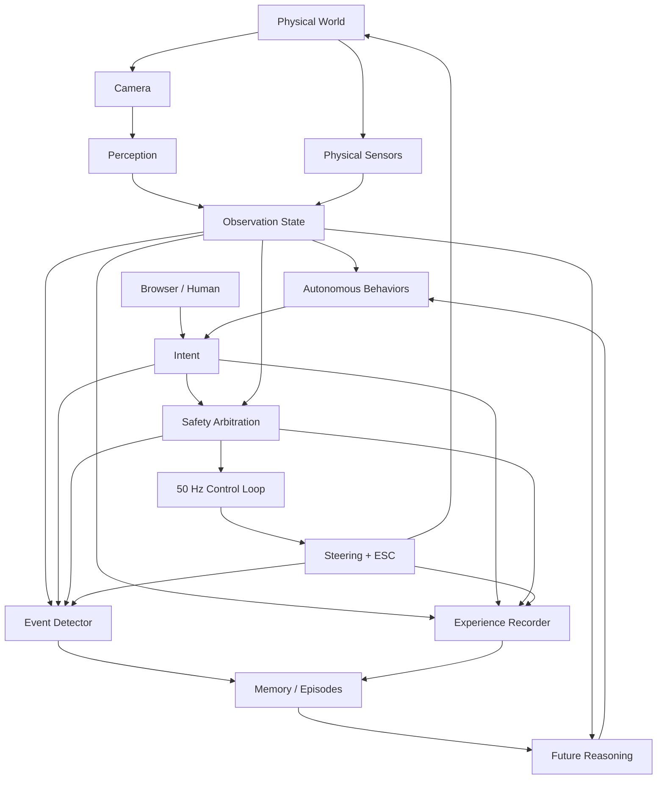

# Cyber Ferret

A Raspberry Pi-based experimental autonomous RC rover.

Cyber Ferret uses a layered architecture so perception and higher-level reasoning can suggest behavior without bypassing deterministic control and safety systems.

## Current capabilities

- Browser HUD and WASD manual control
- 50 Hz control loop
- Camera MJPEG stream
- ArUco marker perception
- Autonomous marker-follow mode
- Safe stop when the visual target is lost
- Session recording with frames and JSONL observations
- Semantic event detection
- Hardware drive watchdog
- Git-based development workflow

## Connect

From a computer on the same network:

```bash
ssh jesse@cyberferret.local
```

## Run

```bash
source ~/cyberferret-venv/bin/activate
cd ~/cyberferret
uvicorn cyberferret_web:app --host 0.0.0.0 --port 8000
```

Then open Cyber Ferret's port `8000` in a browser.

## Stop the server

Use `Ctrl+C`. The application shutdown path stops propulsion, centers steering, stops recording and camera capture, and releases the PWM hardware.

## Shut down the Pi

Before removing power:

```bash
sudo shutdown -h now
```

## Architecture



The important architectural rule:

> Perception and reasoning may influence intent, but they do not directly control hardware.

Deterministic safety and control retain final authority over the body.

See [docs/architecture.md](docs/architecture.md) for more detail.

## Hardware calibration

| Setting | Value |
| --- | ---: |
| Steering center | 99° |
| Steering left | 132° |
| Steering right | 78° |
| ESC neutral | 1535 µs |
| Forward start | ~1631 µs |
| Forward maximum currently used | 1665 µs |
| Reverse start | ~1518 µs |
| Reverse maximum currently used | 1500 µs |

These are physical calibration values for this vehicle, not generic constants.

## Runtime layout

```text
~/cyberferret/        Git working tree
~/cyberferret-venv/   Python virtual environment
~/cyberferret-data/   Recorded sessions and future persistent memory
```

## Safety

Test new motion or autonomous behavior with the drive wheels elevated first.

`SPACE` is the emergency stop in MANUAL and FOLLOW modes. A lower-level drive watchdog also returns propulsion to neutral if the drive layer stops receiving commands.

## Documentation

- [Architecture](docs/architecture.md)
- [Roadmap](docs/roadmap.md)

## Philosophy

Cyber Ferret is not intended to become one giant AI process that emits motor commands.

The goal is a small embodied system with understandable layers: reflexes where reflexes are appropriate, perception where perception is required, memory where history matters, and slower machine reasoning only where ambiguity actually benefits from it.

In other words: more tiny robotic animal, less LLM duct-taped to an ESC.
