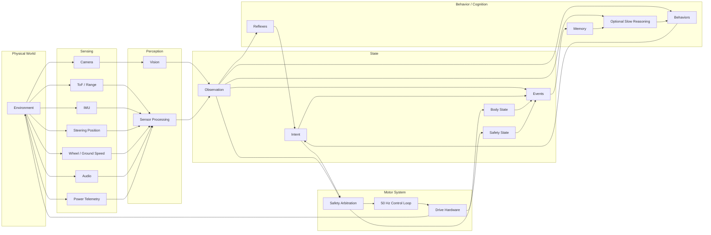
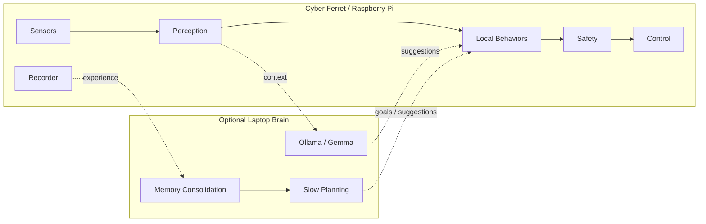

# Cyber Ferret Architecture

## Design goal

Cyber Ferret is a layered embodied system rather than a monolithic autonomous-driving program.

Fast, safety-critical behavior remains deterministic. Perception turns raw sensor input into observations. Behaviors turn observations and goals into intent. Safety can veto intent. Only the control layer talks to actuators.

Higher-level reasoning can eventually participate above those boundaries rather than replacing them.

## System model



Not every sensor shown is installed yet. This describes the intended architecture and attachment points for the incoming sensor suite.

## Core loop

```text
sense
  ↓
perceive
  ↓
update observation
  ↓
choose intent
  ↓
apply safety constraints
  ↓
control body
  ↓
observe outcome
  ↺
```

Example:

```text
INTENT
follow marker forward

OBSERVATION
marker visible
marker is far away
front range = 0.18 m

SAFETY
forward motion vetoed: obstacle too close

BODY
throttle = neutral

EVENT
OBSTACLE_STOP
```

Vision was not wrong. Its proposed behavior was overridden by a higher-priority physical constraint.

## Intent

Intent describes what a controller wants the vehicle to do.

Examples include human forward motion, marker-follow steering, or a future exploration behavior requesting motion toward open space.

Intent records its source so experience can distinguish human commands from autonomous ones.

## Observation

Observation describes what Cyber Ferret currently believes it senses.

The structure is intended to absorb:

- visual target information
- front / rear / left / right distance
- ground distance
- heading, pitch, roll and yaw rate
- actual steering angle
- ground or wheel speed
- battery voltage, current and power
- sound level and direction

Unknown measurements remain unknown rather than being synthesized.

## Body state

Keep these concepts distinct:

```text
requested steering
commanded steering
measured steering
```

and:

```text
requested throttle
commanded throttle
measured velocity
```

Once steering-position and speed sensing are available, Cyber Ferret can compare commands with outcomes and detect things like wheel slip, blocked steering, getting stuck, and inaccurate predictions.

## Safety arbitration

Safety is an authority boundary, not an autonomous behavior.

Potential constraints include:

- control-link watchdog
- emergency stop
- obstacle proximity
- cliff / drop detection
- excessive pitch or roll
- unreasonable speed
- low battery
- sensor-health failures

Safety rules should remain deterministic wherever practical.

## Reflexes vs behaviors

A reflex is fast, local and deterministic: obstacle too close → stop; cliff detected → stop; control signal disappears → neutral throttle.

A behavior is goal-directed and can operate over longer periods: follow marker, investigate an object, explore a room, return to a known location.

Behaviors propose intent. Reflexes and safety may interrupt them.

## Experience and events

Cyber Ferret records synchronized camera frames, intent, body state, observations, safety state, operating mode, and timing information. As sensors are added, ordinary driving becomes increasingly rich embodied experience.

Important changes also become semantic events, for example:

```text
TARGET_ACQUIRED
TARGET_LOST
TARGET_REACHED
OBSTACLE_STOP
CONTROL_LINK_LOST
STUCK
COLLISION_SUSPECTED
NOVEL_OBJECT
```

Events bridge continuous telemetry and memory.

## Memory

Not everything deserves permanent storage.

```text
raw telemetry / frames
        ↓
short-lived session data
        ↓
semantic events
        ↓
episodes
        ↓
durable learned facts / models
```

Raw data can expire aggressively unless it participates in something useful or unusual. Events and episodes can survive based on novelty, recurrence, utility, prediction error, or explicit importance.

This prevents “memory” from becoming a euphemism for never deleting anything.

## Slow reasoning

Laptop-hosted models such as Ollama/Gemma can eventually provide non-deterministic reasoning where latency is not safety-critical.

Good candidates: interpreting unfamiliar situations, selecting behaviors, forming hypotheses, memory consolidation, planning, and deciding what deserves investigation.

Bad candidate: deciding whether to stop before hitting a chair in the next 73 milliseconds. Deterministic code gets that glamorous assignment.

## Deployment boundary



If the laptop disappears, Wi-Fi fails, or inference takes too long, Cyber Ferret should become less clever — not unsafe.

## Guiding principle

Preserve a comprehensible causal chain:

> What did Cyber Ferret perceive, what did it want to do, what did safety permit, what did its body actually do, and what happened next?

If recorded state can answer those questions, increasingly sophisticated behavior remains debuggable without resorting to robot mysticism.
