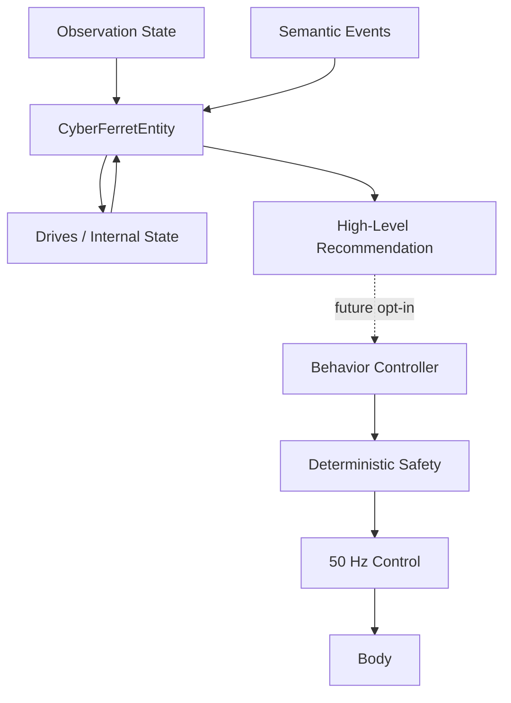

# AI Entity Foundation

The AI entity sits above perception/events and below future behavior selection.

It does **not** control actuators.

## First internal drives

- curiosity
- caution
- social interest
- confidence
- energy
- boredom

These are explicit numeric state variables, not role-play prose.

Events modify them incrementally. They also drift slowly over time.

Examples:

- `TARGET_ACQUIRED` raises curiosity/social interest and lowers boredom.
- `OBSTACLE_STOP` raises caution and lowers confidence.
- `TARGET_REACHED` raises confidence.
- Acute caution gradually decays toward a baseline.

## First behavior vocabulary

The entity currently scores:

- `WAIT`
- `FOLLOW`
- `INVESTIGATE`

The result is a **recommendation**, not a command.

A future integration step can decide whether entity recommendations are allowed to select an existing behavior controller. The current safety and control architecture remains unchanged.

## Why this starts hardware-free

The entity consumes abstractions, not GPIO/I2C values. This lets us test personality dynamics and decision policy in simulation while physical sensors are still being added.

Incoming ToF/IMU/steering/speed data will enrich `ObservationState`; the entity contract should not need to change merely because Cyber Ferret gains another sense.

## Next integration step

Feed newly emitted semantic events into `CyberFerretEntity.consume_events()` from the existing event thread, tick the entity at a slow rate (around 2–5 Hz), and expose its snapshot in `FerretState` / the HUD.

Initially the entity should remain **advisory only**.

Once its state transitions and recommendations are observable and sane, add an explicit ENTITY mode in which recommendations may select deterministic behaviors such as FOLLOW or future INVESTIGATE.
