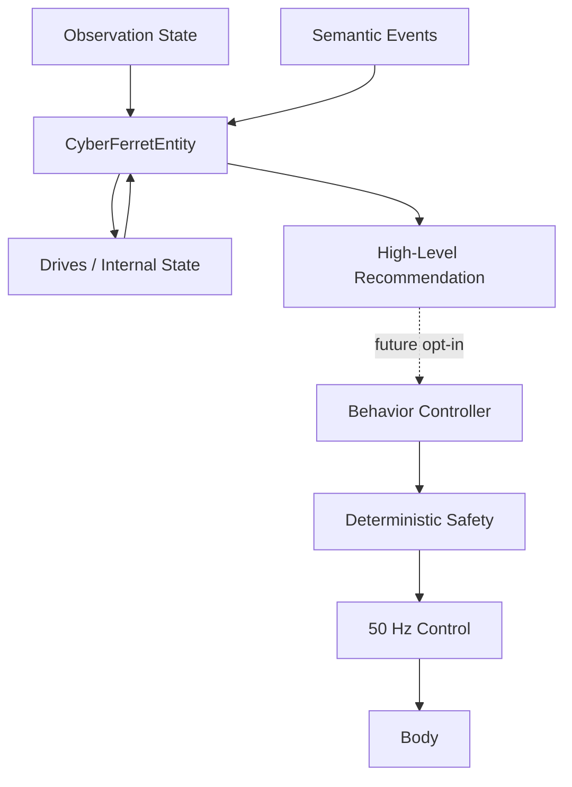

# AI Entity Foundation

The AI entity sits above perception/events and below future behavior selection.

It does **not** control actuators.

## First internal drives

- curiosity
- caution
- social interest
- confidence
- energy
- boredom

These are explicit numeric state variables, not role-play prose.

Events modify them incrementally. They also drift slowly over time.

Examples:

- `TARGET_ACQUIRED` raises curiosity/social interest and lowers boredom.
- `OBSTACLE_STOP` raises caution and lowers confidence.
- `TARGET_REACHED` raises confidence.
- Acute caution gradually decays toward a baseline.

## First behavior vocabulary

The entity currently scores:

- `WAIT`
- `FOLLOW`
- `INVESTIGATE`

The result is a **recommendation**, not a command.

## Runtime integration

The entity now runs as a slow advisory loop alongside control, vision, and event
processing.

New semantic events are fed into `CyberFerretEntity.consume_events()`. The
entity ticks at 4 Hz, evaluates the current observation and safety state, and
publishes its drives plus behavior recommendation into `FerretState`.

That state flows through the existing recorder and websocket/HUD paths, so the
entity's changing internal state becomes both observable and recordable.

It remains **advisory only**. There is intentionally no connection from an
entity recommendation to `ControlHub`, the drive layer, or safety arbitration.

This gives us live internal state before granting the entity any
behavior-selection authority.

## Why this starts hardware-free

The entity consumes abstractions, not GPIO/I2C values. This lets us test
personality dynamics and decision policy in simulation while physical sensors
are still being added.

Incoming ToF/IMU/steering/speed data will enrich `ObservationState`; the entity
contract should not need to change merely because Cyber Ferret gains another
sense.

## Next integration step

Observe the entity in simulation and on the physical ferret. Verify that its
drive changes and recommendations remain sensible across target acquisition,
target loss, safety events, and periods of inactivity.

Once those transitions are useful rather than merely entertaining, add an
explicit `ENTITY` mode in which recommendations may select deterministic
behaviors such as FOLLOW or a future INVESTIGATE behavior.

The entity should still never emit actuator commands directly.
